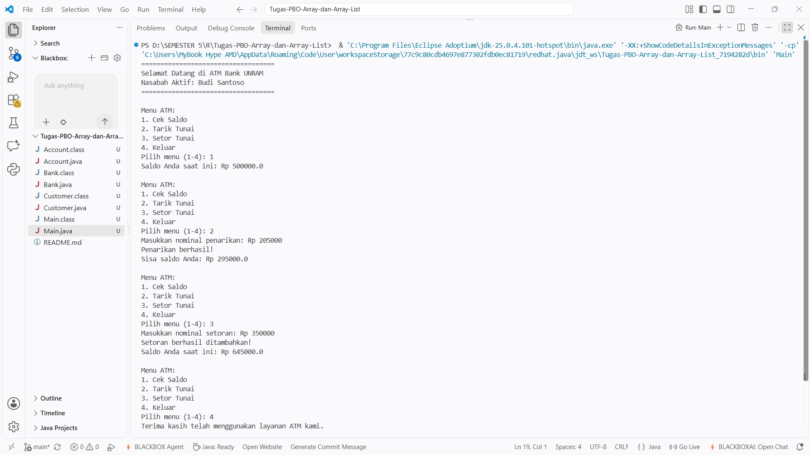

# Tugas PBO - Implementasi Relasi Kelas (Bank System)

Repositori ini berisi implementasi tugas Pemrograman Berorientasi Objek (PBO) mengenai pembuatan dan relasi antar kelas (`Account`, `Customer`, dan `Bank`) serta penggunaan Array of Objects. Program ini dilengkapi dengan program utama yang menyimulasikan mesin ATM interaktif sederhana melalui antarmuka baris perintah (CLI).

## Deskripsi Kelas

1. **`Account.java`**
   Kelas ini merepresentasikan akun bank milik nasabah. Menyimpan atribut `balance` (saldo) dan memiliki metode `deposit` (setor tunai) untuk menambah saldo, serta `withdraw` (tarik tunai) untuk mengurangi saldo dengan validasi agar tidak minus.

2. **`Customer.java`**
   Kelas ini merepresentasikan data nasabah. Menyimpan informasi nama depan (`firstName`) dan nama belakang (`lastName`). Selain itu, kelas ini memiliki array `accounts` yang dapat menampung maksimal 5 objek `Account` milik nasabah tersebut.

3. **`Bank.java`**
   Kelas ini merepresentasikan sistem bank itu sendiri. Mengelola array `customers` untuk menyimpan kumpulan objek `Customer`. Kelas ini menyediakan metode `addCustomer` untuk menambahkan nasabah baru ke dalam sistem dan melacak jumlah total nasabah.

4. **`Main.java`**
   Kelas utama yang berisi `main method`. Program ini menginisialisasi objek `Bank`, menambahkan nasabah uji coba, memberikan saldo awal, dan menjalankan perulangan `while` dipadukan dengan `Scanner` untuk menampilkan menu ATM yang interaktif.

---

## Hasil Eksekusi Program (Output)

Berikut adalah tangkapan layar dari hasil eksekusi program di terminal Visual Studio Code:

### Penjelasan Alur Output:
Berdasarkan gambar di atas, berikut adalah simulasi transaksi yang terjadi:
1. **Inisialisasi Awal:** Program berhasil dijalankan dan menampilkan pesan selamat datang untuk nasabah yang sedang aktif, yaitu **Budi Santoso**.
2. **Cek Saldo (Menu 1):** Pengguna memilih menu 1. Sistem memanggil metode `getBalance()` dan menampilkan saldo awal akun sebesar **Rp 500000.0**.
3. **Tarik Tunai (Menu 2):** Pengguna memilih menu 2 dan memasukkan nominal penarikan sebesar **Rp 205000**. Metode `withdraw()` memvalidasi transaksi tersebut, berhasil melakukannya, dan memperbarui sisa saldo menjadi **Rp 295000.0**.
4. **Setor Tunai (Menu 3):** Pengguna memilih menu 3 dan memasukkan nominal setoran sebesar **Rp 350000**. Metode `deposit()` memproses input tersebut, saldo bertambah, dan total saldo saat ini diperbarui menjadi **Rp 645000.0**.
5. **Keluar (Menu 4):** Pengguna memilih menu 4 untuk mengakhiri perulangan. Program berhenti dan menampilkan pesan perpisahan "Terima kasih telah menggunakan layanan ATM kami."